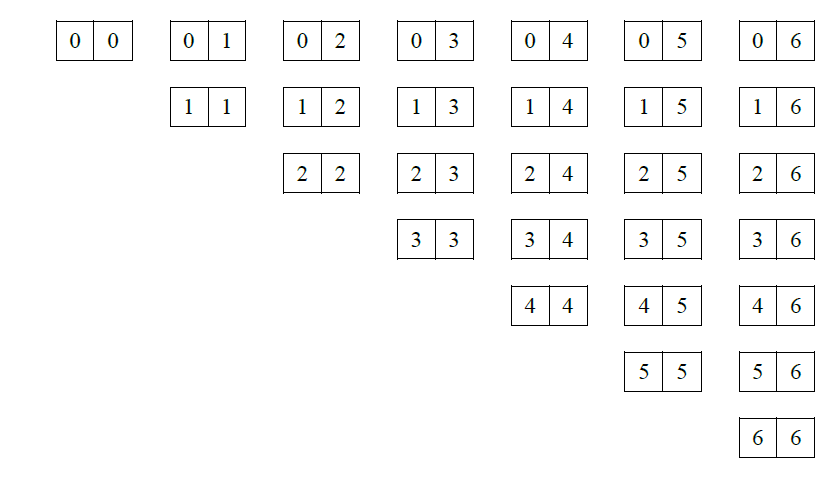
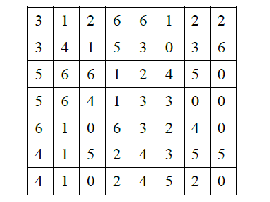
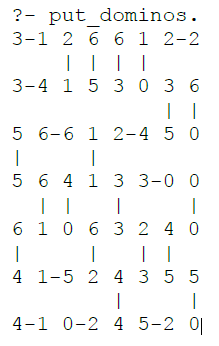

Έστω ότι κωδικοποιούμε τις παρακάτω πλάκες ντόμινο  
 
και το παρακάτω πεδίο 
 
ως εξής: 
dominos([ 
&emsp;(0,0),(0,1),(0,2),(0,3),(0,4),(0,5),(0,6), 
&emsp;(1,1),(1,2),(1,3),(1,4),(1,5),(1,6), 
&emsp;(2,2),(2,3),(2,4),(2,5),(2,6), 
&emsp;(3,3),(3,4),(3,5),(3,6), 
&emsp;(4,4),(4,5),(4,6), 
&emsp;(5,5),(5,6), 
&emsp;(6,6) 
]). 
frame([ 
&emsp;[3,1,2,6,6,1,2,2], 
&emsp;[3,4,1,5,3,0,3,6], 
&emsp;[5,6,6,1,2,4,5,0], 
&emsp;[5,6,4,1,3,3,0,0], 
&emsp;[6,1,0,6,3,2,4,0], 
&emsp;[4,1,5,2,4,3,5,5], 
&emsp;[4,1,0,2,4,5,2,0] 
]). 
Ορίζεται το κατηγόρημα put_dominos/0 το οποίο τοποθετεί τα διαθέσιμα ντόμινο (εάν γίνεται) στο πεδίο, και εμφανίζει το αποτέλεσμα ως εξής: 
 

